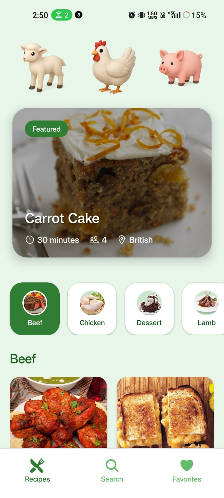
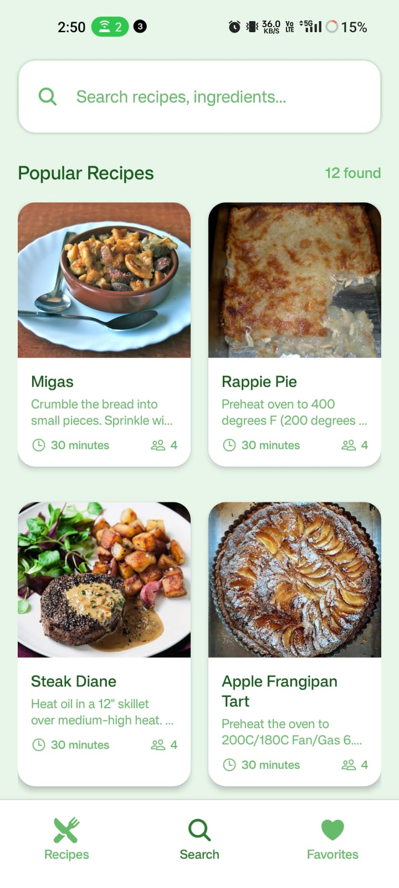
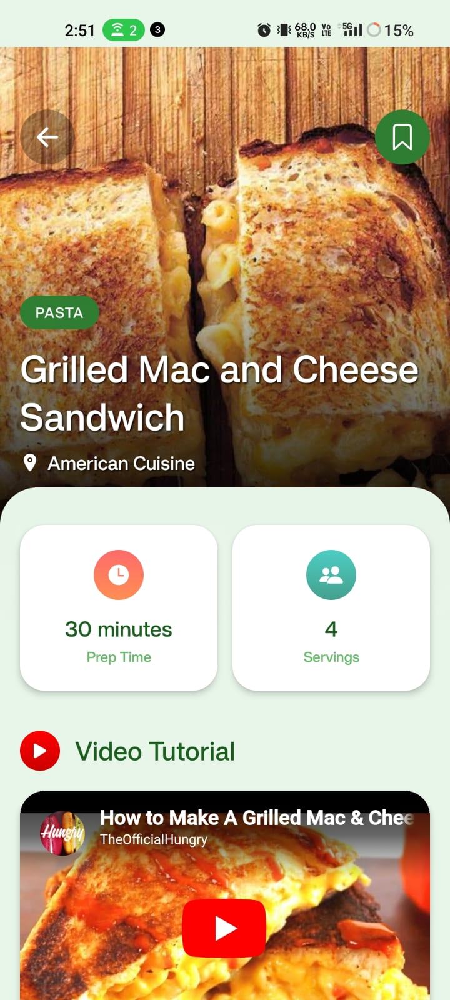

# 🍳 Recipe App - Your Culinary Companion

<div align="start">
  
  
  
  
</div>

<div align="start">
  <h3>🥘 Discover, Save & Cook Amazing Recipes 🍴</h3>
  <p>A modern cross-platform mobile application for food enthusiasts to explore, bookmark, and enjoy delicious recipes from around the world.</p>
</div>

---

## 📸 Screenshots

| Home Page | Feature Page | Mobile View |
|----------|--------------|-------------|
|  |  |  |

---

## 📱 Features

### 🔥 Core Features
- 🍽️ **Recipe Discovery** - Browse thousands of recipes from TheMealDB
- 🔍 **Smart Search** - Search by recipe name or ingredients
- 📂 **Category Filtering** - Explore recipes by cuisine categories
- ❤️ **Favorites System** - Save your favorite recipes for later
- 🎲 **Random Recipe** - Discover new dishes with random suggestions
- 👤 **User Authentication** - Secure user registration and login

### 🌟 Advanced Features
- 📧 **Email Verification** - Secure account verification system
- 🔐 **Password Recovery** - Forget password with email reset
- 🌐 **Cross-Platform** - Works on both iOS and Android
- 🎨 **Beautiful UI** - Modern and intuitive interface
- ⚡ **Real-time Updates** - Live data synchronization
- 🔄 **Pull to Refresh** - Easy content updates

---

## 🛠️ Tech Stack

### 📱 Frontend (Mobile)
- **React Native** - Cross-platform mobile development
- **Expo** - Development platform and tools
- **Clerk** - Authentication and user management
- **Expo Router** - File-based navigation
- **Expo Image** - Optimized image loading

### ⚙️ Backend (API)
- **Node.js** - Runtime environment
- **Express.js** - Web application framework
- **MongoDB** - NoSQL database
- **Mongoose** - MongoDB object modeling
- **JWT** - JSON Web Tokens for authentication
- **Nodemailer** - Email service integration
- **Cloudinary** - Image upload and management
- **Bcrypt** - Password hashing

### 🌐 External APIs
- **TheMealDB** - Recipe data source
- **Cloudinary** - Image storage and optimization

---

## 📂 Project Structure

```
Recipe-App/
├── 📱 mobile/                 # React Native frontend
│   ├── app/                   # Expo Router pages
│   │   ├── (tabs)/           # Tab navigation screens
│   │   │   ├── index.jsx     # Home screen
│   │   │   ├── search.jsx    # Search screen
│   │   │   └── favorites.jsx # Favorites screen
│   │   └── recipe/           # Recipe detail screens
│   ├── components/           # Reusable components
│   ├── services/             # API services
│   ├── hooks/                # Custom hooks
│   ├── constants/            # App constants
│   └── assets/               # Images, styles, fonts
├── 🗄️ backend/               # Node.js backend
│   ├── controllers/          # Route controllers
│   ├── models/               # Database models
│   ├── routes/               # API routes
│   ├── middleware/           # Custom middleware
│   ├── nodemailer/           # Email templates
│   └── config/               # Configuration files
└── 📖 README.md              # Project documentation
```

---

## 🚀 Quick Start

### 📋 Prerequisites
- Node.js (v16 or higher)
- npm or yarn
- MongoDB database
- Expo CLI
- Android Studio / Xcode (for device testing)

### 🔧 Backend Setup

1. **Clone the repository**
   ```bash
   git clone https://github.com/yourusername/recipe-app.git
   cd Recipe-App/backend
   ```

2. **Install dependencies**
   ```bash
   npm install
   ```

3. **Environment Configuration**
   Create a `.env` file in the backend directory:
   ```env
   # Database
   MONGO_URI=your_mongodb_connection_string
   
   # JWT Secret
   JWT_SECRET=your_jwt_secret_key
   
   # Email Configuration
   SMTP_EMAIL=your_gmail_address
   SMTP_APP_PASSWORD=your_gmail_app_password
   
   # Cloudinary Configuration
   CLOUDINARY_NAME=your_cloudinary_name
   CLOUDINARY_API_KEY=your_cloudinary_api_key
   CLOUDINARY_SECRET_KEY=your_cloudinary_secret_key
   
   # Frontend URL (for password reset)
   FRONTEND_URL=http://localhost:3000
   
   # Server Port
   PORT=4000
   ```

4. **Start the server**
   ```bash
   npm start
   ```

### 📱 Mobile Setup

1. **Navigate to mobile directory**
   ```bash
   cd ../mobile
   ```

2. **Install dependencies**
   ```bash
   npm install
   ```

3. **Configure API URL**
   Update `constants/api.js` with your backend URL:
   ```javascript
   export const API_URL = "http://your-backend-url:4000/api/v1";
   ```

4. **Start the development server**
   ```bash
   npx expo start
   ```

5. **Run on device/simulator**
   - Scan QR code with Expo Go app (Android/iOS)
   - Press `a` for Android emulator
   - Press `i` for iOS simulator

---

## 🔌 API Endpoints

### 🔐 Authentication Routes
```
POST   /api/v1/auth/sign-up           # User registration
POST   /api/v1/auth/verify-email      # Email verification
POST   /api/v1/auth/sign-in           # User login
POST   /api/v1/auth/logout            # User logout
POST   /api/v1/auth/forget-password   # Password reset request
POST   /api/v1/auth/reset-password/:token # Password reset
GET    /api/v1/auth/check-auth-user   # Check authentication
GET    /api/v1/auth/get-all-user      # Get all users (admin)
```

### ❤️ Recipe/Favorites Routes
```
POST   /api/v1/recipe/favorites       # Add recipe to favorites
GET    /api/v1/recipe/favorites/:userId # Get user favorites
DELETE /api/v1/recipe/favorites/:id/:userId # Remove from favorites
```

### 🧪 Test Route
```
GET    /test                          # Server health check
```

---


## 🔄 Key Features Workflow

### 🍳 Recipe Discovery Flow
1. **Browse Categories** 🗂️ - Select from various cuisine categories
2. **Search Recipes** 🔍 - Find recipes by name or ingredients
3. **View Details** 📖 - Check ingredients, instructions, and nutrition
4. **Save Favorites** ❤️ - Bookmark recipes for later cooking

### 👤 User Authentication Flow
1. **Sign Up** ✍️ - Create account with email verification
2. **Email Verification** 📧 - Verify account via email OTP
3. **Login** 🔑 - Secure authentication with JWT
4. **Password Recovery** 🔐 - Reset password via email link

---

## 🤝 Contributing

We welcome contributions! Here's how you can help:

### 🐛 Found a Bug?
- Open an issue with detailed description
- Include steps to reproduce
- Add screenshots if applicable

### 💡 Have a Feature Idea?
- Check existing issues first
- Open a feature request
- Describe the use case and benefits

### 🔧 Want to Contribute Code?
1. **Fork the repository**
2. **Create a feature branch**
   ```bash
   git checkout -b feature/amazing-feature
   ```
3. **Make your changes**
4. **Add tests if applicable**
5. **Commit your changes**
   ```bash
   git commit -m "Add amazing feature"
   ```
6. **Push to your branch**
   ```bash
   git push origin feature/amazing-feature
   ```
7. **Open a Pull Request**

---

## 📄 License

This project is licensed under the MIT License - see the [LICENSE](LICENSE) file for details.

---

## 🙏 Acknowledgments

- 🍽️ **TheMealDB** - For providing the recipe database API
- ☁️ **Cloudinary** - For image storage and optimization services
- 🎨 **Expo** - For the amazing development platform
- 📱 **React Native Community** - For the excellent documentation and support

---

## 📞 Support & Contact

<div align="start">
  
**Need Help? Have Questions?**

📧 **Email**: viahalyadav0987@gmail.com  
🐛 **Issues**: [GitHub Issues](https://github.com/vishalyadav0987/recipe-app/issues)  
💬 **Discussions**: [GitHub Discussions](https://github.com/vishalyadav0987/recipe-app/discussions)

---

### 🌟 If you found this project helpful, please give it a star! ⭐

**Made with ❤️ by [Vishal Yaddav]**

</div>

---

<div align="center">
  <sub>🍳 Happy Cooking! 👨‍🍳👩‍🍳</sub>
</div>
